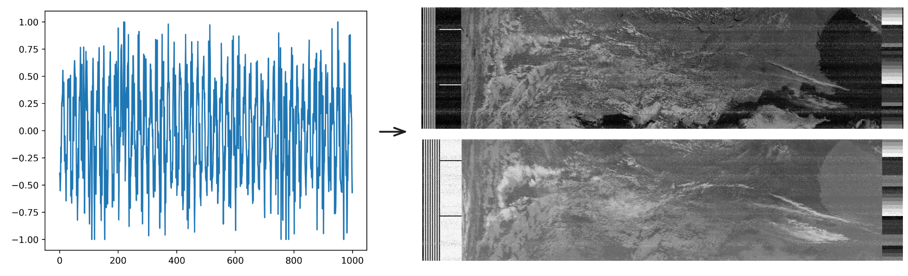

# NOAA APT Satellite Signal Decoder

[](#)
[](#)
[](https://github.com/zietzm/satellite/actions/workflows/ci.yml)

A tool to decode NOAA APT satellite signals from `.wav` recordings into grayscale satellite images.



## Why This Project?

I created this to learn Haskell through a real-world problem: decoding [NOAA's Automatic Picture Transmission](https://en.wikipedia.org/wiki/Automatic_picture_transmission) signals.

## Overview

- **Input**: Accepts `.wav` files of APT satellite transmissions.
- **Processing**: Decodes signals into pixel data using Haskell.
- **Output**: Generates grayscale PNG images of satellite passes.

## Installation

### With Stack

First ensure you have [Stack](https://docs.haskellstack.org/en/stable/).

```bash
git clone https://github.com/zietzm/satellite.git
cd satellite
stack install
satellite-exe --help
```

### With Nix

If you prefer, use [Nix](https://nixos.org/).

```bash
git clone https://github.com/zietzm/satellite.git
cd satellite
nix develop
stack install
satellite-exe --help
```

## Usage

```bash
satellite-exe input-file.wav output-file.png
```

* `input-file.wav`: Recorded NOAA APT signal.
* `output-file.png`: Output satellite image.
